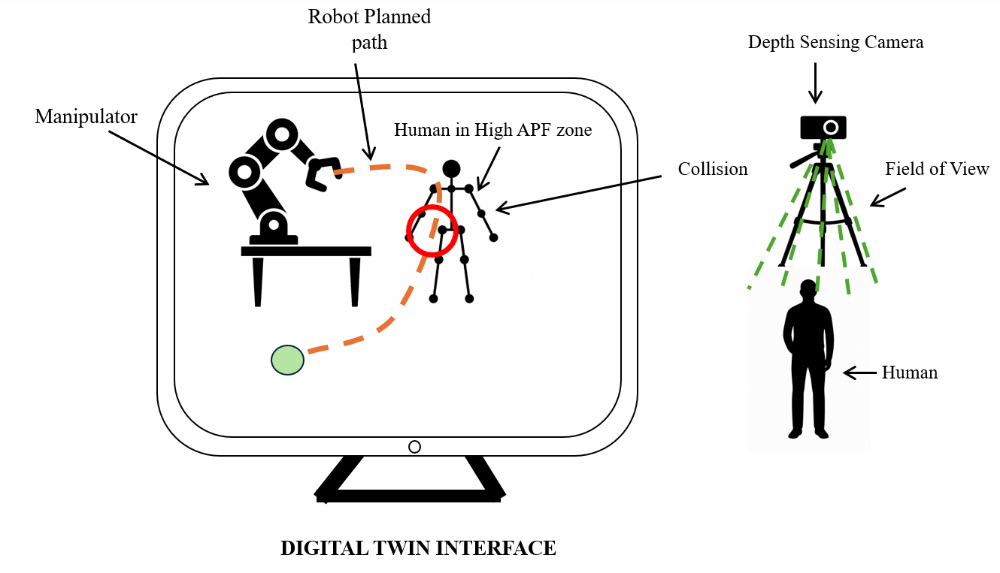
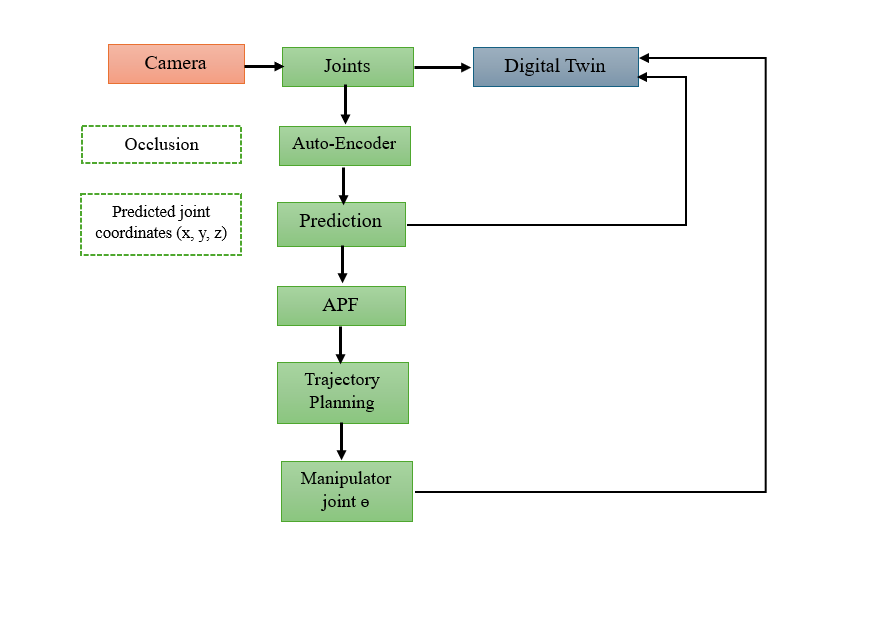

# Proactive Human-Manipulator Collision Avoidance

This project presents a **proactive motion planning and safety framework** for industrial robotic manipulators operating in dynamic human-shared environments. The system predicts human skeletal motion and replans robot trajectories in real-time using a GPU-accelerated digital twin, ensuring **safe and intelligent human-robot collaboration**.

---

## Key Features

- **3D Human Pose Estimation** using Orbbec depth camera and MediaPipe
- **Human Motion Forecasting** with a Bi-LSTM neural network
- **Artificial Potential Field (APF)** computation for collision risk evaluation
- **A-RRT\*** motion planning algorithm with GPU acceleration (via CuPy)
- **Digital Twin Simulation** in ROS 2 with Gazebo and RViz
- **Real-Time Replanning** to avoid predicted human movements
- **Joint Trajectory Control** with live feedback via ROS 2

---

##  System Architecture

1. Capture 3D skeleton joint positions from RGB-D camera
2. Predict future human motion using LSTM model
3. Evaluate collision risk using APF on predicted joint-robot proximity
4. If risk > threshold → trigger A-RRT\* replan
5. Send new joint trajectory to robot via ROS 2

---

## Technologies Used

- **ROS 2 (Foxy)** for real-time communication
- **Gazebo** + **RViz** for simulation & visualization
- **Python**, **CuPy** for GPU acceleration
- **MediaPipe** for real-time human skeleton tracking
- **Orbbec Femto Bolt SDK** for RGB-D data streaming
- **LSTM + CNN** based human motion forecasting network
- **UR16e** robotic arm (URDF model in Gazebo)

---

## Performance Summary

| Metric                          | Result                    |
|--------------------------------|---------------------------|
| Planning Time (Pre-Optimized)  | 6–60 seconds              |
| Planning Time (Post-Optimized) | 0.6–2.0 seconds           |
| Minimum Robot-Human Distance   | ≥ 275 mm (all trials)     |
| Replans Triggered              | 100% of unsafe predictions |
| Prediction-to-Actuation Delay  | < 200 ms                  |

---

## Test Scenarios

- Static human near robot
- Human walking through workspace
- Occluded joint segments during motion

All scenarios maintained safety margins and successful dynamic replanning.

